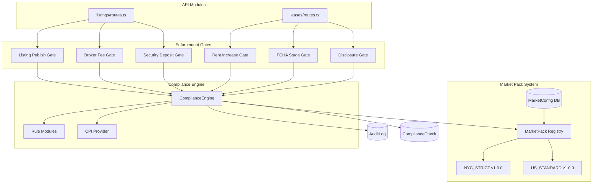
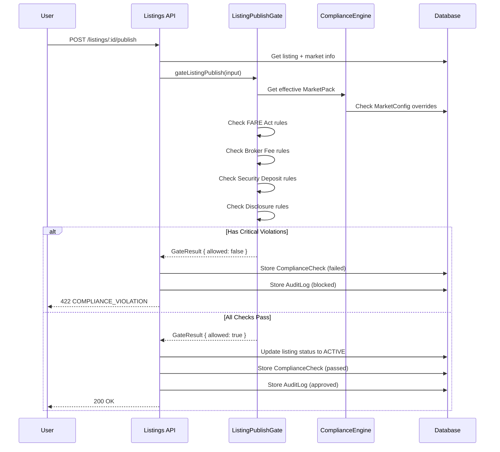
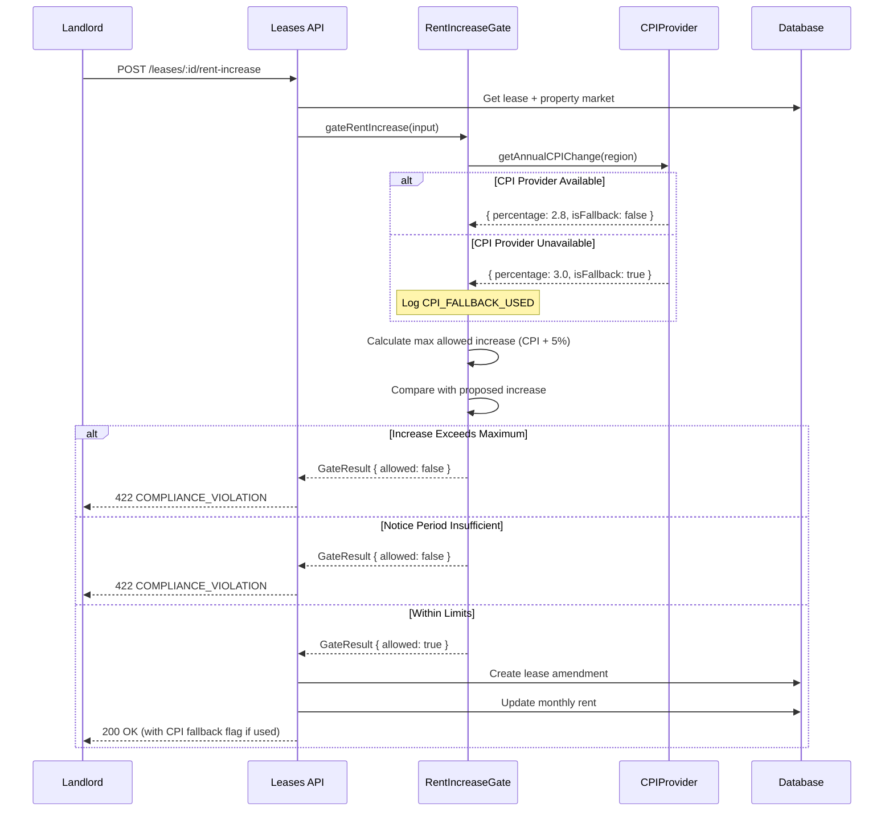
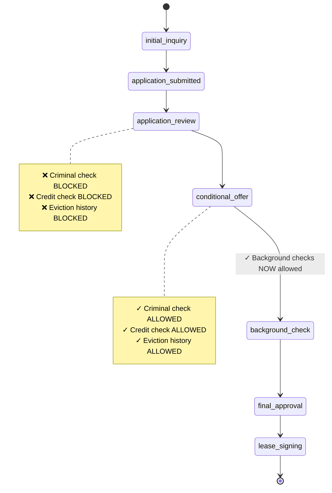

# Compliance Enforcement System

## Overview

RealRiches implements enterprise-grade compliance enforcement through a **Market Pack** system with versioned rule sets and **Compliance Gates** that enforce requirements at critical points in the application lifecycle.

## Architecture



## Market Packs

### NYC_STRICT v1.0.0

New York City comprehensive compliance including:

| Rule | Description | Effective Date |
|------|-------------|----------------|
| FARE Act | Broker fees paid by landlord only | 2024-09-21 |
| FCHA | Background checks after conditional offer | 2020-01-01 |
| Good Cause | Rent increases limited to CPI + 5% | 2024-04-20 |
| Rent Stabilization | RGB board compliance | Ongoing |
| Security Deposit | Max 1 month rent | Ongoing |

### US_STANDARD v1.0.0

Baseline federal compliance:

| Rule | Description |
|------|-------------|
| Lead Paint | Required disclosure pre-1978 buildings |
| Fair Housing | Non-discrimination requirements |
| Security Deposit | Max 2 months (default) |

## Compliance Decision Object

All gates return a standardized decision object:

```typescript
interface ComplianceDecision {
  passed: boolean;
  violations: Violation[];
  recommendedFixes: RecommendedFix[];
  policyVersion: string;      // e.g., "1.0.0"
  marketPack: string;         // e.g., "NYC_STRICT"
  marketPackVersion: string;  // e.g., "1.0.0"
  checkedAt: string;          // ISO datetime
  checksPerformed: string[];  // e.g., ["fare_act", "security_deposit"]
  metadata?: Record<string, unknown>;
}

interface Violation {
  code: ViolationCode;        // e.g., "FARE_BROKER_FEE_PROHIBITED"
  message: string;            // Human-readable description
  severity: 'info' | 'warning' | 'violation' | 'critical';
  evidence?: Record<string, unknown>;
  ruleReference?: string;
  documentationUrl?: string;
}
```

## Enforcement Flow: Listing Publish



## Enforcement Flow: Rent Increase (Good Cause)



## Enforcement Flow: FCHA Stage Transition



## Violation Codes

### FARE Act
| Code | Severity | Description |
|------|----------|-------------|
| `FARE_BROKER_FEE_PROHIBITED` | Critical | Tenant cannot pay broker fee |
| `FARE_BROKER_FEE_EXCESSIVE` | Violation | Fee exceeds maximum |
| `FARE_INCOME_REQUIREMENT_EXCESSIVE` | Violation | >40x rent requirement |
| `FARE_CREDIT_SCORE_THRESHOLD_EXCESSIVE` | Violation | >650 credit score requirement |

### FCHA
| Code | Severity | Description |
|------|----------|-------------|
| `FCHA_CRIMINAL_CHECK_BEFORE_OFFER` | Critical | Background check before conditional offer |
| `FCHA_STAGE_ORDER_VIOLATION` | Violation | Skipped required stage |

### Good Cause
| Code | Severity | Description |
|------|----------|-------------|
| `GOOD_CAUSE_RENT_INCREASE_EXCESSIVE` | Critical | Increase exceeds CPI + 5% |
| `GOOD_CAUSE_EVICTION_INVALID_REASON` | Critical | Invalid eviction reason |
| `GOOD_CAUSE_NOTICE_PERIOD_INSUFFICIENT` | Violation | Less than required notice |
| `GOOD_CAUSE_CPI_FALLBACK_USED` | Info | Using fallback CPI data |

### Security Deposit
| Code | Severity | Description |
|------|----------|-------------|
| `SECURITY_DEPOSIT_EXCESSIVE` | Critical | Exceeds maximum months |

### Disclosures
| Code | Severity | Description |
|------|----------|-------------|
| `DISCLOSURE_NOT_DELIVERED` | Critical | Required disclosure not sent |
| `DISCLOSURE_NOT_ACKNOWLEDGED` | Violation | Signature required but not obtained |

## API Endpoints with Enforcement

### Listings

| Endpoint | Gate | Checks |
|----------|------|--------|
| `POST /listings/:id/publish` | `gateListingPublish` | FARE, broker fee, security deposit, disclosures |
| `PATCH /listings/:id` (broker fee change) | `gateBrokerFeeChange` | FARE, broker fee limits |
| `PATCH /listings/:id` (deposit change) | `gateSecurityDepositChange` | Deposit limits |

### Leases

| Endpoint | Gate | Checks |
|----------|------|--------|
| `POST /leases/:id/rent-increase` | `gateRentIncrease` | Good Cause CPI limits, notice period |
| `POST /leases/applications/:id/transition` | `gateFCHAStageTransition` | Stage order enforcement |
| `POST /leases/applications/:id/background-check` | `gateFCHABackgroundCheck` | Check timing enforcement |
| `POST /leases` | `gateLeaseCreation` | Security deposit, rent stabilization, disclosures |

## Feature Flags

All enforcement can be toggled per-market via feature flags:

| Flag | Description |
|------|-------------|
| `fare_act_enforcement` | Enable FARE Act broker fee prohibition |
| `fcha_enforcement` | Enable FCHA stage order enforcement |
| `good_cause_enforcement` | Enable Good Cause rent limits |
| `rent_stabilization_enforcement` | Enable rent stabilization checks |
| `broker_fee_enforcement` | Enable broker fee limits |
| `security_deposit_enforcement` | Enable deposit limits |
| `disclosure_enforcement` | Enable disclosure requirements |

## CPI Provider

Good Cause rent increase calculations require CPI data. The system includes:

1. **ExternalCPIProvider** - Connects to BLS API (TODO: requires implementation)
2. **FallbackCPIProvider** - Deterministic fallback values when external unavailable

When fallback is used:
- Logged as `CPI_FALLBACK_USED` violation (severity: info)
- Included in compliance decision metadata
- Uses conservative 3% default if no historical data available

## Database Integration

### ComplianceCheck Table

Every gate result is recorded:

```sql
ComplianceCheck {
  id: string
  entityType: string       -- 'listing', 'lease', 'application'
  entityId: string
  marketId: string
  checkType: string        -- 'fare_act,broker_fee,disclosures'
  status: 'passed' | 'failed'
  severity: 'info' | 'warning' | 'violation' | 'critical'
  title: string
  description: string
  details: JSON            -- Full violation/fix details
  recommendation: string
  createdAt: timestamp
}
```

### AuditLog Table

All enforcement actions are audited:

```sql
AuditLog {
  id: string
  actorId: string
  actorEmail: string
  action: string           -- 'listing_publish_approved', 'rent_increase_blocked'
  entityType: string
  entityId: string
  changes: JSON
  metadata: JSON           -- Compliance decision details
  requestId: string
  createdAt: timestamp
}
```

## Testing

### Unit Tests

```bash
# Run compliance engine tests
pnpm --filter @realriches/compliance-engine test
```

Tests cover:
- Each NYC rule individually
- Gate behavior for blocking/allowing
- CPI fallback behavior
- Market pack detection

### Integration Tests

```bash
# Run API integration tests
pnpm --filter @realriches/api test
```

Tests verify:
- Publish invalid listing → blocked with audit log
- Publish valid listing → approved
- FCHA stage skip → blocked
- Excessive rent increase → blocked

## Extending the System

### Adding a New Market Pack

1. Create pack definition in `packages/compliance-engine/src/market-packs.ts`:

```typescript
export const CA_STANDARD_V1: MarketPack = {
  id: 'CA_STANDARD',
  name: 'California Standard Compliance',
  version: { major: 1, minor: 0, patch: 0 },
  // ... rules
};
```

2. Add to registry:

```typescript
export const MARKET_PACKS: Record<MarketPackId, MarketPack> = {
  // ...
  CA_STANDARD: CA_STANDARD_V1,
};
```

3. Update market-to-pack mapping in `getMarketPackIdFromMarket()`.

### Adding a New Rule

1. Add violation code to `types.ts`
2. Implement check function in `rules.ts`
3. Wire into appropriate gate(s) in `gates.ts`
4. Add tests
5. Update documentation

## Deployment Considerations

- ComplianceCheck and AuditLog tables should have appropriate indexes
- CPI provider API key should be configured for production
- Feature flags allow gradual rollout per market
- Market pack versions enable policy versioning for compliance audits
