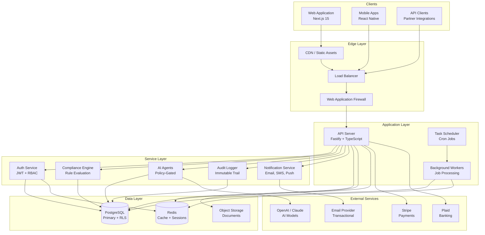
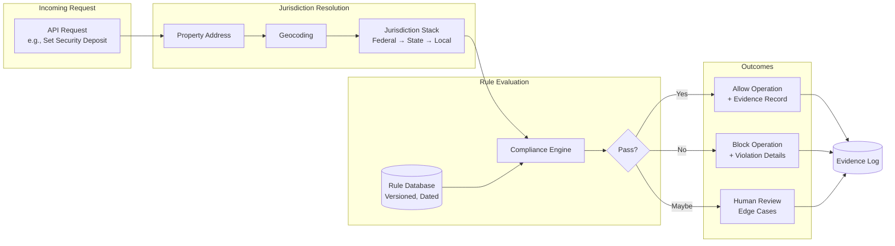
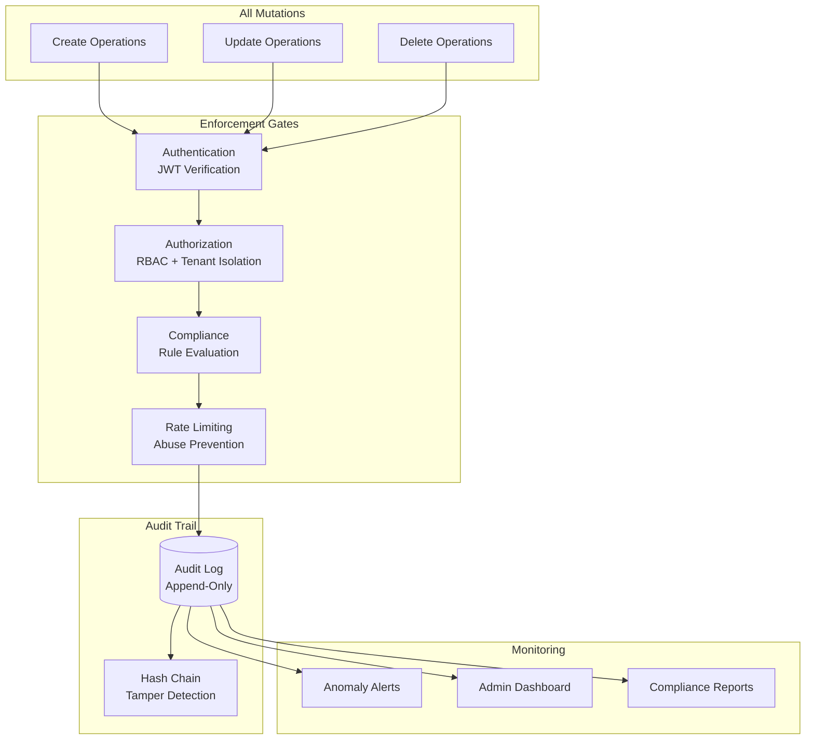
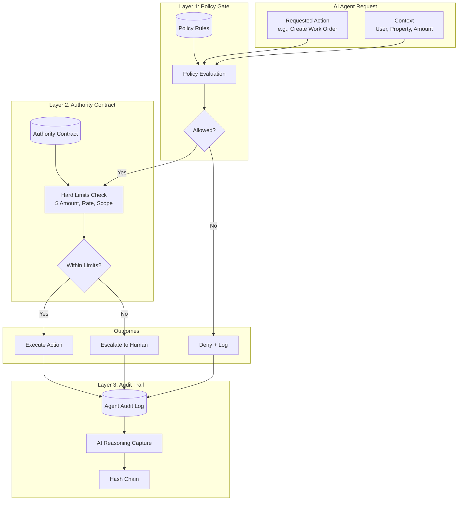

# RealRiches Technical Dossier

## Executive Summary

RealRiches is an AI-powered real estate investment platform built with enterprise-grade architecture. The platform combines modern cloud-native design with comprehensive compliance automation, audit logging, and AI governance to minimize operational and regulatory risk.

**Key Technical Differentiators:**
- **Compliance Autopilot**: Automated enforcement of 50-state landlord-tenant regulations
- **AI Governance**: Policy-gated agents with authority contracts and full audit trails
- **Immutable Audit Logging**: Every mutation logged with actor, context, and changes
- **Multi-Tenant Isolation**: Database-level row security (RLS) for data segregation

---

## Architecture Overview

### Technology Stack

| Layer | Technology | Purpose |
|-------|------------|---------|
| Frontend | Next.js 15, React 18, TailwindCSS | Modern web application |
| API | Fastify, TypeScript | High-performance REST API |
| Database | PostgreSQL | Primary data store with RLS |
| Cache | Redis | Session management, rate limiting |
| ORM | Prisma | Type-safe database access |
| Authentication | JWT + Refresh Tokens | Stateless auth with rotation |
| AI | OpenAI API, Claude API | Intelligent automation |
| Payments | Stripe | PCI-compliant payment processing |

### High-Level Architecture



### Monorepo Structure

```
realriches/
├── apps/
│   ├── api/                    # Fastify API (40+ modules)
│   └── web/                    # Next.js frontend
├── packages/
│   ├── database/               # Prisma schema (222 models)
│   ├── compliance-engine/      # Jurisdiction-aware rules
│   ├── ai-sdk/                 # AI integration layer
│   ├── partners-contracts/     # Partner provider interfaces
│   └── [8 more packages]
└── docs/
    ├── adr/                    # Architecture Decision Records
    └── investor/               # This dossier
```

---

## Compliance Autopilot

### How It Works

The Compliance Engine enforces real estate regulations **before** operations execute, preventing violations rather than detecting them after the fact.



### Compliance Coverage

| Domain | Examples | Enforcement |
|--------|----------|-------------|
| Security Deposits | State-specific limits (e.g., CA = 2-3 months) | Pre-operation gate |
| Fair Housing | Protected class screening prevention | Application workflow |
| Disclosures | Lead paint, mold, flood zone | Document generation |
| Eviction Process | Notice periods, cure rights | Workflow enforcement |
| Rent Control | Local ordinance limits | Rate change validation |

### Evidence Generation

Every compliance decision generates an immutable evidence record:

```typescript
interface ComplianceEvidence {
  id: string;
  timestamp: Date;
  operationType: string;           // 'SET_SECURITY_DEPOSIT'
  jurisdiction: string[];          // ['US', 'CA', 'LOS_ANGELES']
  rulesEvaluated: RuleResult[];    // Each rule with pass/fail
  outcome: 'ALLOWED' | 'BLOCKED';
  actor: { id: string; type: string };
  contentHash: string;             // Tamper detection
}
```

---

## Audit Logging & Governance

### Risk Reduction Through Transparency

The platform implements defense-in-depth through multiple governance layers:



### What Gets Logged

| Event Type | Data Captured | Retention |
|------------|---------------|-----------|
| Authentication | Login attempts, token refresh, logout | 2 years |
| Data Mutations | Before/after state, actor, timestamp | 7 years |
| Compliance Decisions | Rules evaluated, outcome, evidence | 7 years |
| AI Agent Actions | Reasoning, policy decisions, results | 7 years |
| Access Patterns | Resource access, query patterns | 1 year |

### Sensitive Data Handling

Audit logs automatically redact sensitive fields:

```typescript
const REDACTED_FIELDS = [
  'password', 'ssn', 'bankAccountNumber',
  'creditCardNumber', 'apiKey', 'secret'
];

// Logged as: { ssn: '[REDACTED]', ... }
```

---

## AI Agent Governance

### Policy-Gated Automation

AI agents operate under strict governance with three enforcement layers:



### Authority Contracts

Each agent type operates under an explicit authority contract:

| Agent Type | Permissions | Hard Limits | Requires Human |
|------------|-------------|-------------|----------------|
| Maintenance | Create work orders, schedule vendors | $5,000/order, 200/day | Emergency repairs, >$1,000 |
| Leasing | Answer inquiries, schedule showings | No lease modifications | Application decisions |
| Communications | Send templated messages | No legal topics | Eviction-related |
| Analysis | Read-only data access | No write operations | Never |

### AI Disclosure

All tenant/vendor communications from AI agents include mandatory disclosure:

```
This message was composed with AI assistance.
For human support, reply with "HUMAN" or call [phone].
```

---

## Multi-Tenant Architecture

### Data Isolation

RealRiches uses PostgreSQL Row-Level Security (RLS) for tenant isolation:

```sql
-- Every tenant-scoped table
ALTER TABLE properties ENABLE ROW LEVEL SECURITY;

CREATE POLICY tenant_isolation ON properties
  USING (tenant_id = current_setting('app.current_tenant_id')::uuid);
```

**Benefits:**
- Database-enforced isolation (not application-dependent)
- Single bug cannot leak cross-tenant data
- Satisfies SOC 2 data segregation requirements

### Tenant Hierarchy

```
Platform (RealRiches)
└── Tenant (Property Management Company)
    └── Properties
        └── Units
            └── Leases
                └── Tenants
```

---

## Related Documentation

| Document | Purpose |
|----------|---------|
| [Security Posture](security-posture.md) | OWASP controls, SOC 2 mapping |
| [Compliance Evidence](compliance-evidence.md) | Evidence generation, diligence support |
| [Architecture Decision Records](../adr/) | Key technical decisions with rationale |

---

*This document is intended for technical due diligence. For questions, contact the engineering team.*
