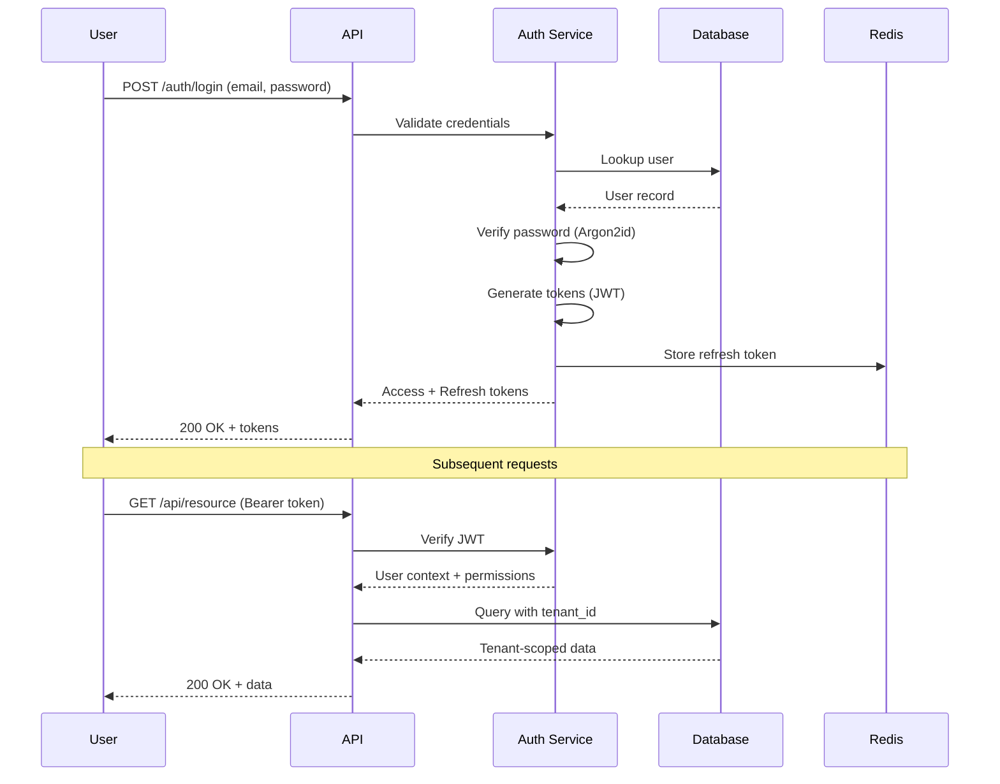
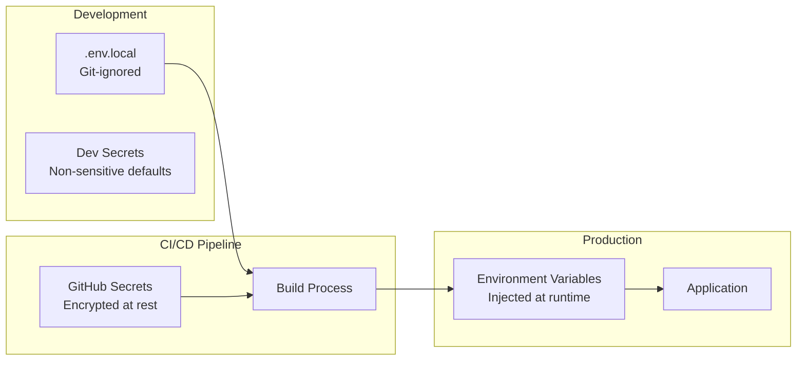
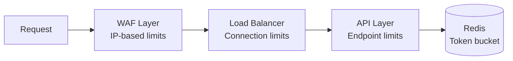
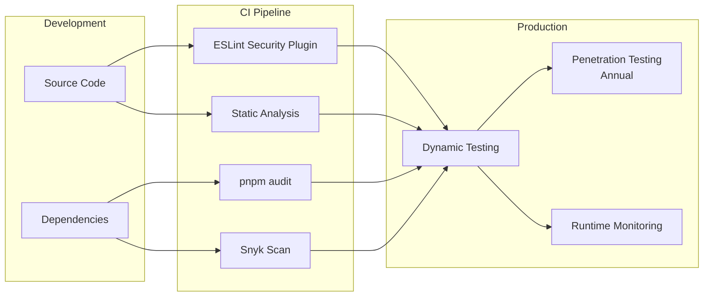

# Security Posture

## Overview

RealRiches implements defense-in-depth security controls aligned with OWASP guidelines and SOC 2 Type II requirements. This document outlines the security architecture and control mappings.

---

## OWASP Top 10 Baseline

### Control Implementation Status

| OWASP Category | Control | Implementation |
|----------------|---------|----------------|
| A01: Broken Access Control | RBAC + Tenant Isolation | Row-Level Security (RLS) at database layer; role-based permissions; tenant_id enforcement on all queries |
| A02: Cryptographic Failures | Encryption at Rest/Transit | TLS 1.3 for all connections; AES-256 for sensitive data; Argon2id for password hashing |
| A03: Injection | Parameterized Queries | Prisma ORM with parameterized queries; no raw SQL in application code; input validation via Zod schemas |
| A04: Insecure Design | Threat Modeling | Architecture Decision Records (ADRs); security review for new features; principle of least privilege |
| A05: Security Misconfiguration | Hardened Defaults | Helmet.js security headers; strict CORS; disabled debug endpoints in production |
| A06: Vulnerable Components | Dependency Scanning | Automated `pnpm audit` in CI; Snyk integration; zero known vulnerabilities policy |
| A07: Authentication Failures | JWT + Refresh Tokens | Short-lived access tokens (15 min); secure refresh rotation; rate-limited auth endpoints |
| A08: Integrity Failures | Signed Artifacts | CI/CD pipeline verification; immutable deployments; hash-chained audit logs |
| A09: Logging Failures | Comprehensive Audit | All mutations logged; structured logging; sensitive field redaction |
| A10: SSRF | Request Validation | Allowlisted external endpoints; no user-controlled URLs in server requests |

---

## Authentication & Authorization

### Authentication Flow



### Password Security

| Control | Implementation |
|---------|----------------|
| Hashing Algorithm | Argon2id (memory-hard, GPU-resistant) |
| Minimum Length | 12 characters |
| Complexity | Uppercase, lowercase, number, special character |
| Breach Detection | HaveIBeenPwned API check on registration |
| Rate Limiting | 5 attempts per 15 minutes per IP |
| Account Lockout | Temporary lockout after 10 failed attempts |

### Role-Based Access Control (RBAC)

```
Platform Roles:
├── PLATFORM_ADMIN      # RealRiches staff
├── PLATFORM_SUPPORT    # Customer support

Tenant Roles:
├── TENANT_OWNER        # Full tenant access
├── PROPERTY_MANAGER    # Property operations
├── LEASING_AGENT       # Leasing workflows
├── MAINTENANCE_TECH    # Work orders only
├── ACCOUNTANT          # Financial read access
└── VIEWER              # Read-only access
```

**Permission Matrix Example:**

| Resource | Owner | Manager | Agent | Tech | Viewer |
|----------|-------|---------|-------|------|--------|
| Properties | CRUD | CRUD | R | R | R |
| Leases | CRUD | CRUD | CRU | R | R |
| Payments | CRUD | CRU | R | - | R |
| Work Orders | CRUD | CRUD | CR | CRU | R |
| Financial Reports | R | R | - | - | R |
| User Management | CRUD | R | - | - | - |

---

## Secrets Management

### Architecture



### Secret Categories

| Category | Examples | Storage | Rotation |
|----------|----------|---------|----------|
| Database | Connection strings | Environment variables | On credential change |
| API Keys | Stripe, OpenAI | Environment variables | 90 days |
| JWT Secrets | Signing keys | Environment variables | 30 days |
| Encryption Keys | Data encryption | Environment variables | Annually |

### Safeguards

- **Git Protection**: `.env*` files in `.gitignore`; CI fails if secrets committed
- **No Hardcoding**: ESLint rule prevents string literals matching secret patterns
- **Audit Trail**: Secret access logged (key name, not value)
- **Least Privilege**: Services receive only required secrets

---

## Logging & Redaction

### Structured Logging

All logs follow a consistent JSON structure:

```json
{
  "timestamp": "2025-01-01T00:00:00.000Z",
  "level": "info",
  "service": "api",
  "traceId": "abc123",
  "spanId": "def456",
  "userId": "user_123",
  "tenantId": "tenant_456",
  "action": "lease.create",
  "resourceId": "lease_789",
  "durationMs": 45,
  "metadata": {}
}
```

### Automatic Redaction

Sensitive fields are automatically redacted before logging:

```typescript
const REDACTED_PATTERNS = [
  /password/i,
  /secret/i,
  /token/i,
  /apiKey/i,
  /ssn/i,
  /socialSecurity/i,
  /bankAccount/i,
  /creditCard/i,
  /cvv/i,
  /authorization/i,
];

// Input:  { email: "user@example.com", password: "secret123" }
// Logged: { email: "user@example.com", password: "[REDACTED]" }
```

### Log Levels

| Level | Usage | Retention |
|-------|-------|-----------|
| ERROR | Unhandled exceptions, service failures | 2 years |
| WARN | Recoverable issues, deprecations | 1 year |
| INFO | Business events, audit trail | 7 years (audit) |
| DEBUG | Diagnostic information | 7 days (non-prod only) |

---

## Rate Limiting

### Implementation

Rate limiting is enforced at multiple layers:



### Endpoint Limits

| Endpoint Category | Rate Limit | Window |
|-------------------|------------|--------|
| Authentication | 5 requests | 15 minutes |
| Password Reset | 3 requests | 1 hour |
| API Read | 1000 requests | 1 minute |
| API Write | 100 requests | 1 minute |
| File Upload | 10 requests | 1 minute |
| Webhooks | 1000 requests | 1 minute |

### Response Headers

```http
X-RateLimit-Limit: 100
X-RateLimit-Remaining: 95
X-RateLimit-Reset: 1704067260
Retry-After: 60  # Only on 429 responses
```

---

## SOC 2 Type II Control Mapping

### Trust Service Criteria Coverage

| TSC | Category | RealRiches Controls |
|-----|----------|---------------------|
| CC1 | Control Environment | Documented policies; ADRs; code review requirements |
| CC2 | Communication | Audit logs; incident response procedures; status page |
| CC3 | Risk Assessment | Threat modeling; dependency scanning; penetration testing |
| CC4 | Monitoring | Structured logging; alerting; anomaly detection |
| CC5 | Control Activities | RBAC; input validation; encryption; rate limiting |
| CC6 | Logical Access | JWT authentication; RLS tenant isolation; MFA support |
| CC7 | System Operations | CI/CD pipeline; automated testing; rollback procedures |
| CC8 | Change Management | Git workflow; PR reviews; deployment approvals |
| CC9 | Risk Mitigation | Backup procedures; disaster recovery; vendor assessment |

### Security Controls Detail

| Control ID | Control Description | Implementation |
|------------|---------------------|----------------|
| CC6.1 | Logical access security | JWT + RBAC + RLS |
| CC6.2 | Access provisioning | Role assignment via admin UI; audit logged |
| CC6.3 | Access removal | Immediate token revocation; session termination |
| CC6.6 | Access review | Quarterly access reviews; automated reporting |
| CC6.7 | System authentication | Argon2id passwords; MFA option; SSO support |
| CC6.8 | Encryption | TLS 1.3 transit; AES-256 at rest |
| CC7.1 | Configuration management | Infrastructure as Code; version controlled |
| CC7.2 | Change authorization | PR approval required; CI gates |
| CC7.3 | Infrastructure changes | Terraform; GitOps workflow |
| CC7.4 | Software changes | Semantic versioning; changelog; rollback |

### Availability Controls

| Control | Implementation | RTO | RPO |
|---------|----------------|-----|-----|
| Database Backups | Automated daily; point-in-time recovery | 4 hours | 1 hour |
| Multi-AZ Deployment | Primary + standby in separate availability zones | 5 minutes | 0 |
| CDN/Edge Caching | Static assets cached at edge | N/A | N/A |
| Health Checks | 30-second intervals; auto-failover | 1 minute | 0 |

### Confidentiality Controls

| Data Type | Classification | Controls |
|-----------|----------------|----------|
| PII (SSN, DOB) | Restricted | Encrypted at rest; access logged; redacted in logs |
| Financial (bank, card) | Restricted | Tokenized via Stripe; never stored raw |
| Authentication | Confidential | Hashed (Argon2id); salted; never logged |
| Business Data | Internal | Tenant-isolated; encrypted at rest |
| Audit Logs | Internal | Append-only; hash-chained; 7-year retention |

---

## Vulnerability Management

### Continuous Scanning



### SLA for Remediation

| Severity | CVSS Score | Remediation SLA |
|----------|------------|-----------------|
| Critical | 9.0 - 10.0 | 24 hours |
| High | 7.0 - 8.9 | 7 days |
| Medium | 4.0 - 6.9 | 30 days |
| Low | 0.1 - 3.9 | 90 days |

### Current Status

| Metric | Value |
|--------|-------|
| Known Vulnerabilities | 0 |
| Last Security Audit | [Date] |
| Last Penetration Test | [Date] |
| Dependencies with Updates | 0 |

---

## Incident Response

### Severity Levels

| Level | Definition | Response Time | Examples |
|-------|------------|---------------|----------|
| SEV1 | Complete outage or data breach | 15 minutes | Service down; unauthorized access |
| SEV2 | Partial outage or security risk | 1 hour | Feature unavailable; vulnerability discovered |
| SEV3 | Degraded performance | 4 hours | Slow queries; elevated error rate |
| SEV4 | Minor issue | 24 hours | UI bug; documentation error |

### Response Process

1. **Detection**: Automated alerting or user report
2. **Triage**: Severity classification and team assignment
3. **Containment**: Isolate affected systems if needed
4. **Investigation**: Root cause analysis with audit logs
5. **Remediation**: Fix deployed and verified
6. **Communication**: Stakeholder notification
7. **Post-mortem**: Documented learnings and preventive measures

---

## Related Documentation

| Document | Purpose |
|----------|---------|
| [Technical Overview](README.md) | Architecture and compliance overview |
| [Compliance Evidence](compliance-evidence.md) | Evidence generation and diligence |
| [ADR-0001: Tenancy Strategy](../adr/0001-tenancy-strategy.md) | Multi-tenant isolation decision |
| [ADR-0003: Agent Governance](../adr/0003-agent-governance.md) | AI governance architecture |

---

*Security controls are continuously evaluated and updated. Last review: 2025-01-01*
