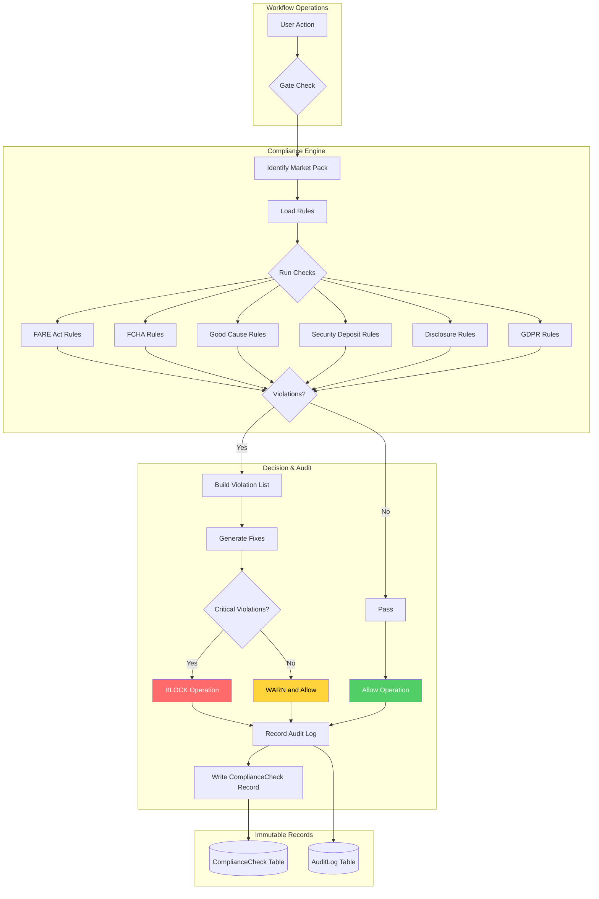
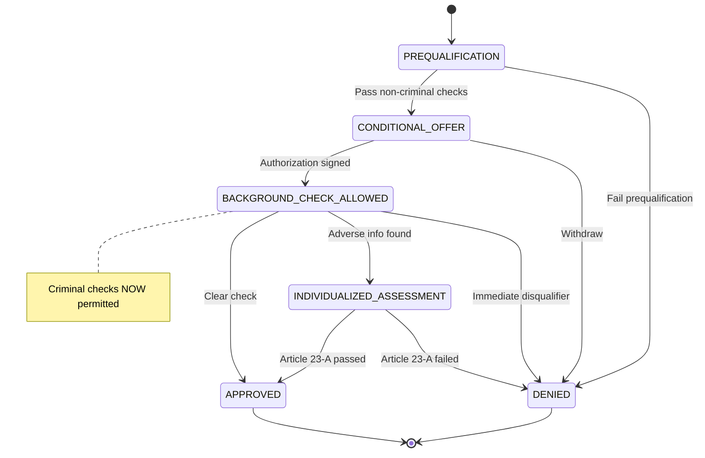
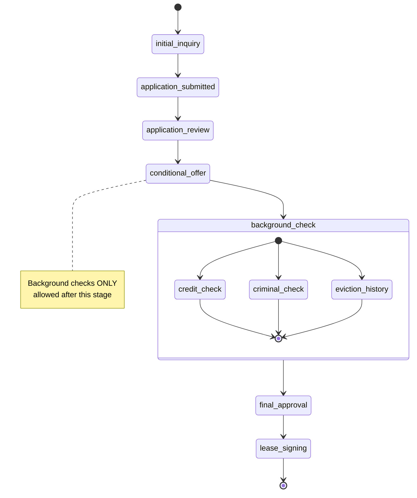
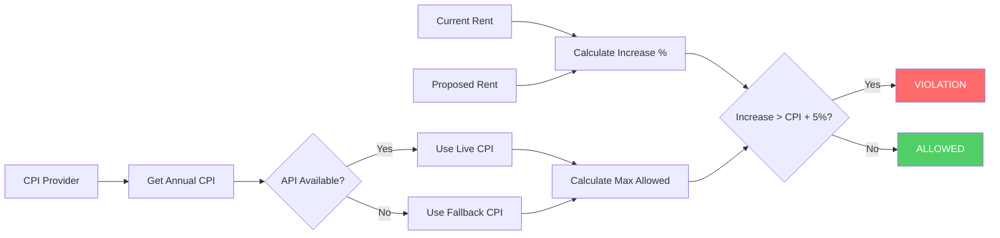

# Compliance Engine

Enterprise-grade compliance enforcement for real estate operations. Implements versioned Market Packs, Compliance Decision protocol, and hard enforcement gates.

## Overview

The Compliance Engine provides:
- **Versioned Market Packs**: Pre-configured compliance rule sets for different jurisdictions
- **Compliance Decision Objects**: Standardized format for all compliance evaluations
- **Hard Enforcement Gates**: Block non-compliant operations at workflow boundaries
- **Immutable Audit Trail**: Every compliance check is recorded with evidence

## Market Packs

| Pack ID | Version | Jurisdiction | Key Features |
|---------|---------|--------------|--------------|
| `NYC_STRICT` | 1.0.0 | New York City | FARE Act, FCHA, Good Cause Eviction, Rent Stabilization |
| `US_STANDARD` | 1.0.0 | United States | Fair Housing Act, Lead Paint Disclosure |
| `UK_GDPR` | 1.0.0 | United Kingdom | GDPR, Tenant Fees Act, Data Protection |

## Compliance Decision Format

```typescript
interface ComplianceDecision {
  passed: boolean;
  violations: Violation[];
  recommendedFixes: RecommendedFix[];
  policyVersion: string;
  marketPack: string;
  marketPackVersion: string;
  checkedAt: string;
  checksPerformed: string[];
  metadata?: Record<string, unknown>;
}

interface Violation {
  code: ViolationCode;
  message: string;
  severity: 'info' | 'warning' | 'violation' | 'critical';
  evidence?: Record<string, unknown>;
  ruleReference?: string;
  documentationUrl?: string;
}
```

## Enforcement Gates

### Listing Publish Gate (DRAFT → ACTIVE)

```typescript
import { gateListingPublish } from '@realriches/compliance-engine';

const result = await gateListingPublish({
  listingId: 'lst_123',
  marketId: 'nyc',
  hasBrokerFee: true,
  brokerFeePaidBy: 'tenant', // Will be blocked in NYC!
  monthlyRent: 3000,
  deliveredDisclosures: ['fare_act_disclosure'],
  acknowledgedDisclosures: [],
});

if (!result.allowed) {
  console.error(result.blockedReason);
  // "Listing cannot be published: FARE Act prohibits requiring tenant to pay broker fee"
}
```

### FCHA Stage Transition Gate

```typescript
import { gateFCHAStageTransition } from '@realriches/compliance-engine';

const result = await gateFCHAStageTransition({
  applicationId: 'app_123',
  marketId: 'nyc',
  currentStage: 'application_review',
  targetStage: 'background_check', // Will be blocked - must go through conditional_offer first
});
```

### Lease Signing Gate

```typescript
import { gateLeaseCreation } from '@realriches/compliance-engine';

const result = await gateLeaseCreation({
  leaseId: 'lse_123',
  marketId: 'nyc',
  monthlyRent: 3000,
  securityDepositAmount: 6000, // Blocked: exceeds 1 month max
  deliveredDisclosures: ['lead_paint_disclosure'],
  acknowledgedDisclosures: ['lead_paint_disclosure'],
});
```

## Compliance Flow



## NYC Fair Chance Housing Act (FCHA) Enforcement

The Fair Chance Housing Act enforces a strict workflow for tenant screening, ensuring criminal background checks cannot occur before a conditional offer.

### Workflow State Machine



### Workflow States

| State | Description | Criminal Checks |
|-------|-------------|-----------------|
| `PREQUALIFICATION` | Evaluate income, credit, rental history | **BLOCKED** |
| `CONDITIONAL_OFFER` | Written offer issued, awaiting authorization | **BLOCKED** |
| `BACKGROUND_CHECK_ALLOWED` | Authorization signed, checks permitted | **ALLOWED** |
| `INDIVIDUALIZED_ASSESSMENT` | Adverse info found, Article 23-A review | **ALLOWED** |
| `APPROVED` | Application approved | N/A |
| `DENIED` | Application denied | N/A |

### Usage

```typescript
import {
  gateFCHAWorkflowTransition,
  gateFCHACriminalCheck,
} from '@realriches/compliance-engine';

// 1. Transition from PREQUALIFICATION to CONDITIONAL_OFFER
const step1 = await gateFCHAWorkflowTransition({
  applicationId: 'app_123',
  marketId: 'NYC',
  currentState: 'PREQUALIFICATION',
  targetState: 'CONDITIONAL_OFFER',
  actorId: 'user_123',
  actorType: 'user',
  prequalificationResults: {
    incomeVerified: true,
    creditCheckPassed: true,
    rentalHistoryVerified: true,
    employmentVerified: true,
  },
  conditionalOfferDetails: {
    unitId: 'unit_456',
    offerLetterDelivered: true,
    deliveryMethod: 'email',
  },
});

// 2. Criminal check BLOCKED before BACKGROUND_CHECK_ALLOWED state
const blockedCheck = await gateFCHACriminalCheck({
  applicationId: 'app_123',
  marketId: 'NYC',
  currentState: 'CONDITIONAL_OFFER', // Still before authorization!
  checkType: 'criminal_background_check',
  actorId: 'user_123',
});
// blockedCheck.allowed = false
// blockedCheck.blockedReason = "Criminal background check blocked: Application is in CONDITIONAL_OFFER state..."

// 3. Transition to BACKGROUND_CHECK_ALLOWED
const step2 = await gateFCHAWorkflowTransition({
  applicationId: 'app_123',
  marketId: 'NYC',
  currentState: 'CONDITIONAL_OFFER',
  targetState: 'BACKGROUND_CHECK_ALLOWED',
  actorId: 'user_123',
  actorType: 'user',
  backgroundCheckAuthorization: {
    authorizationSigned: true,
    signedAt: new Date().toISOString(),
  },
});

// 4. Now criminal check is ALLOWED
const allowedCheck = await gateFCHACriminalCheck({
  applicationId: 'app_123',
  marketId: 'NYC',
  currentState: 'BACKGROUND_CHECK_ALLOWED',
  checkType: 'criminal_background_check',
  actorId: 'user_123',
});
// allowedCheck.allowed = true
```

### Evidence and Audit Trail

Every transition generates complete evidence for audit:

```typescript
const result = await gateFCHAWorkflowTransition({...});

console.log(result.evidence);
// {
//   applicationId: 'app_123',
//   transitionId: 'fcha_app_123_20260101123456789',
//   fromState: 'PREQUALIFICATION',
//   toState: 'CONDITIONAL_OFFER',
//   timestamp: '2026-01-01T12:34:56.789Z',
//   actorId: 'user_123',
//   actorType: 'user',
//   noticesIssued: [{
//     type: 'conditional_offer_letter',
//     issuedAt: '2026-01-01T12:34:56.789Z',
//     deliveryMethod: 'email',
//     recipientId: 'app_123',
//   }],
//   prequalificationResults: {
//     incomeVerified: true,
//     creditCheckPassed: true,
//     rentalHistoryVerified: true,
//     employmentVerified: true,
//     allCriteriaMet: true,
//   },
// }
```

### Article 23-A Individualized Assessment

When adverse criminal history is found, the workflow requires an individualized assessment:

```typescript
// Transition to INDIVIDUALIZED_ASSESSMENT when adverse info found
const assessment = await gateFCHAWorkflowTransition({
  applicationId: 'app_123',
  marketId: 'NYC',
  currentState: 'BACKGROUND_CHECK_ALLOWED',
  targetState: 'INDIVIDUALIZED_ASSESSMENT',
  actorId: 'user_123',
  actorType: 'user',
  adverseInfoDetails: {
    adverseInfoFound: true,
    adverseInfoSummary: 'Prior misdemeanor conviction 8 years ago',
    noticeDelivered: true,
  },
});

// Response window is tracked (10 days for mitigating factors)
console.log(assessment.evidence?.responseWindow);
// { opensAt: '...', closesAt: '...', daysAllowed: 10, responded: false }

// When denying, must consider Article 23-A factors
const denial = await gateFCHAWorkflowTransition({
  applicationId: 'app_123',
  marketId: 'NYC',
  currentState: 'INDIVIDUALIZED_ASSESSMENT',
  targetState: 'DENIED',
  actorId: 'user_123',
  actorType: 'user',
  finalDecision: {
    decision: 'denied',
    rationale: 'After individualized assessment...',
    article23AFactorsConsidered: [
      'nature_of_offense',
      'time_elapsed_since_offense',
      'relationship_to_housing',
      'evidence_of_rehabilitation',
    ],
  },
});
```

## FCHA Stage Order Enforcement (Legacy)



## Good Cause Rent Increase Calculation



## NYC FARE Act Enforcement

The FARE (Fair Access to Rental Equity) Act is enforced through multiple compliance rules in the `NYC_STRICT` market pack.

### Core Rules

#### 1. Listing Agent Tenant Fee Prohibition

When a broker/agent represents the landlord (listing agent), tenants cannot be charged broker fees.

```typescript
import { gateListingPublish } from '@realriches/compliance-engine';

// BLOCKED: Listing agent charging tenant
const blocked = await gateListingPublish({
  listingId: 'lst_123',
  marketId: 'NYC',
  hasBrokerFee: true,
  brokerFeeAmount: 3000,
  brokerFeePaidBy: 'tenant',        // Tenant pays
  agentRepresentation: 'landlord',   // Agent represents landlord
  monthlyRent: 2500,
  deliveredDisclosures: ['fare_act_disclosure', 'fare_fee_disclosure'],
  acknowledgedDisclosures: [],
});
// result.allowed = false
// result.decision.violations includes FARE_LISTING_AGENT_TENANT_FEE

// ALLOWED: Landlord pays their agent
const allowed = await gateListingPublish({
  listingId: 'lst_456',
  marketId: 'NYC',
  hasBrokerFee: true,
  brokerFeeAmount: 3000,
  brokerFeePaidBy: 'landlord',       // Landlord pays
  agentRepresentation: 'landlord',
  monthlyRent: 2500,
  deliveredDisclosures: ['fare_act_disclosure', 'fare_fee_disclosure'],
  acknowledgedDisclosures: [],
  feeDisclosure: {
    disclosed: true,
    disclosedFees: [{ type: 'broker_fee', amount: 3000, paidBy: 'landlord' }],
  },
});
// result.allowed = true
```

#### 2. Fee Disclosure Requirement

All tenant-paid fees must be disclosed in both the listing and rental agreement.

```typescript
// BLOCKED: Missing fee disclosure
const blocked = await gateListingPublish({
  listingId: 'lst_789',
  marketId: 'NYC',
  hasBrokerFee: false,
  monthlyRent: 2500,
  deliveredDisclosures: ['fare_act_disclosure', 'fare_fee_disclosure'],
  acknowledgedDisclosures: [],
  feeDisclosure: {
    disclosed: false,  // Not disclosed!
    disclosedFees: [],
  },
});
// result.allowed = false
// result.decision.violations includes FARE_FEE_DISCLOSURE_MISSING

// ALLOWED: All fees properly disclosed
const allowed = await gateListingPublish({
  listingId: 'lst_abc',
  marketId: 'NYC',
  hasBrokerFee: false,
  monthlyRent: 2500,
  deliveredDisclosures: ['fare_act_disclosure', 'fare_fee_disclosure'],
  acknowledgedDisclosures: [],
  feeDisclosure: {
    disclosed: true,
    disclosedFees: [
      { type: 'application_fee', amount: 50, paidBy: 'tenant' },
      { type: 'move_in_fee', amount: 200, paidBy: 'tenant' },
    ],
  },
});
// result.allowed = true
```

### Evidence and Audit Trail

Every FARE Act violation includes complete evidence for audit and remediation:

```typescript
const violation = result.decision.violations.find(
  v => v.code === 'FARE_LISTING_AGENT_TENANT_FEE'
);

console.log(violation);
// {
//   code: 'FARE_LISTING_AGENT_TENANT_FEE',
//   message: 'NYC FARE Act: When broker represents landlord (listing agent), tenants cannot be charged broker fees',
//   severity: 'critical',
//   evidence: {
//     agentRepresentation: 'landlord',
//     hasBrokerFee: true,
//     brokerFeeAmount: 3000,
//     brokerFeePaidBy: 'tenant',
//     rule: 'NYC Admin Code § 26-3101(b)',
//     rationale: 'The FARE Act prohibits tenants from paying broker fees when the broker was hired by or represents the landlord.',
//   },
//   ruleReference: 'FARE Act - Listing Agent Tenant Fee Prohibition',
//   documentationUrl: 'https://legistar.council.nyc.gov/LegislationDetail.aspx?ID=6454633',
// }

const fix = result.decision.recommendedFixes.find(
  f => f.action === 'remove_tenant_broker_fee'
);

console.log(fix);
// {
//   action: 'remove_tenant_broker_fee',
//   description: 'Remove tenant broker fee or assign fee to landlord (who hired the listing agent)',
//   autoFixAvailable: true,
//   autoFixAction: 'set_broker_fee_paid_by_landlord',
//   priority: 'critical',
// }
```

### Enforcement Points

FARE Act rules are checked at these workflow boundaries:

| Gate | Checks Performed |
|------|-----------------|
| `gateListingPublish` | Broker fee prohibition, fee disclosure, income/credit limits |
| `gateListingUpdate` | Same as publish (prevents adding illegal fees to active listings) |
| `gateLeaseCreation` | Broker fee prohibition, fee disclosure (at lease signing) |

### Disclosable Fee Types

The following fee types must be disclosed when charged to tenants:

- `broker_fee` - Broker/agent commission
- `application_fee` - Application processing fee
- `move_in_fee` - Move-in costs
- `credit_check_fee` - Credit report fee
- `background_check_fee` - Background check fee
- `security_deposit` - Security deposit
- `pet_fee` - Pet deposit/fee
- `amenity_fee` - Amenity access fees
- `parking_fee` - Parking fees
- `storage_fee` - Storage fees

## Violation Codes

### NYC (FARE Act, FCHA, Good Cause)

| Code | Severity | Description |
|------|----------|-------------|
| `FARE_BROKER_FEE_PROHIBITED` | Critical | Tenant cannot pay broker fee |
| `FARE_LISTING_AGENT_TENANT_FEE` | Critical | Listing agent charging tenant broker fee |
| `FARE_FEE_DISCLOSURE_MISSING` | Critical | Required fee disclosure not provided |
| `FARE_INCOME_REQUIREMENT_EXCESSIVE` | Violation | Income requirement > 40x rent |
| `FARE_CREDIT_SCORE_THRESHOLD_EXCESSIVE` | Violation | Credit score requirement > 650 |
| `FCHA_CRIMINAL_CHECK_BEFORE_OFFER` | Critical | Background check before conditional offer |
| `FCHA_BACKGROUND_CHECK_NOT_ALLOWED` | Critical | Criminal check in wrong workflow state |
| `FCHA_CONDITIONAL_OFFER_REQUIRED` | Critical | Conditional offer must be issued first |
| `FCHA_PREQUALIFICATION_INCOMPLETE` | Critical | Prequalification criteria not met |
| `FCHA_INDIVIDUALIZED_ASSESSMENT_REQUIRED` | Critical | Article 23-A assessment required |
| `FCHA_NOTICE_NOT_ISSUED` | Critical | Required notice not delivered |
| `FCHA_INVALID_STATE_TRANSITION` | Critical | Invalid workflow state transition |
| `FCHA_STAGE_ORDER_VIOLATION` | Critical | Skipping application stages |
| `GOOD_CAUSE_RENT_INCREASE_EXCESSIVE` | Critical | Rent increase > CPI + 5% |
| `GOOD_CAUSE_EVICTION_INVALID_REASON` | Critical | Eviction reason not in allowed list |

### UK (GDPR)

| Code | Severity | Description |
|------|----------|-------------|
| `GDPR_CONSENT_MISSING` | Critical | No consent for data processing |
| `GDPR_LAWFUL_BASIS_MISSING` | Critical | No lawful basis specified |
| `GDPR_PRIVACY_NOTICE_MISSING` | Critical | Privacy notice not provided |
| `GDPR_DATA_SUBJECT_REQUEST_OVERDUE` | Critical | DSR not resolved in 30 days |
| `GDPR_DATA_RETENTION_EXCEEDED` | Violation | Data held beyond retention period |
| `GDPR_REDACTION_REQUIRED` | Warning | Sensitive fields need redaction |

## Integration with Database

The engine can persist compliance checks and audit logs:

```typescript
import { configureComplianceEngine } from '@realriches/compliance-engine';
import { prisma } from '@realriches/database';

configureComplianceEngine({
  async createAuditLog(entry) {
    const log = await prisma.auditLog.create({ data: entry });
    return log.id;
  },
  async createComplianceCheck(check) {
    const record = await prisma.complianceCheck.create({ data: check });
    return record.id;
  },
  async getMarketConfig(marketId) {
    return prisma.marketConfig.findUnique({ where: { marketId } });
  },
});
```

## Testing

```bash
# Run all compliance tests
pnpm test

# Run with coverage
pnpm test:coverage
```

## License

Proprietary - RealRiches Inc.
