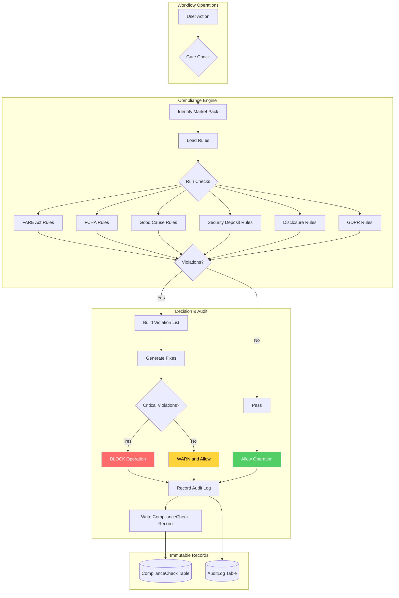
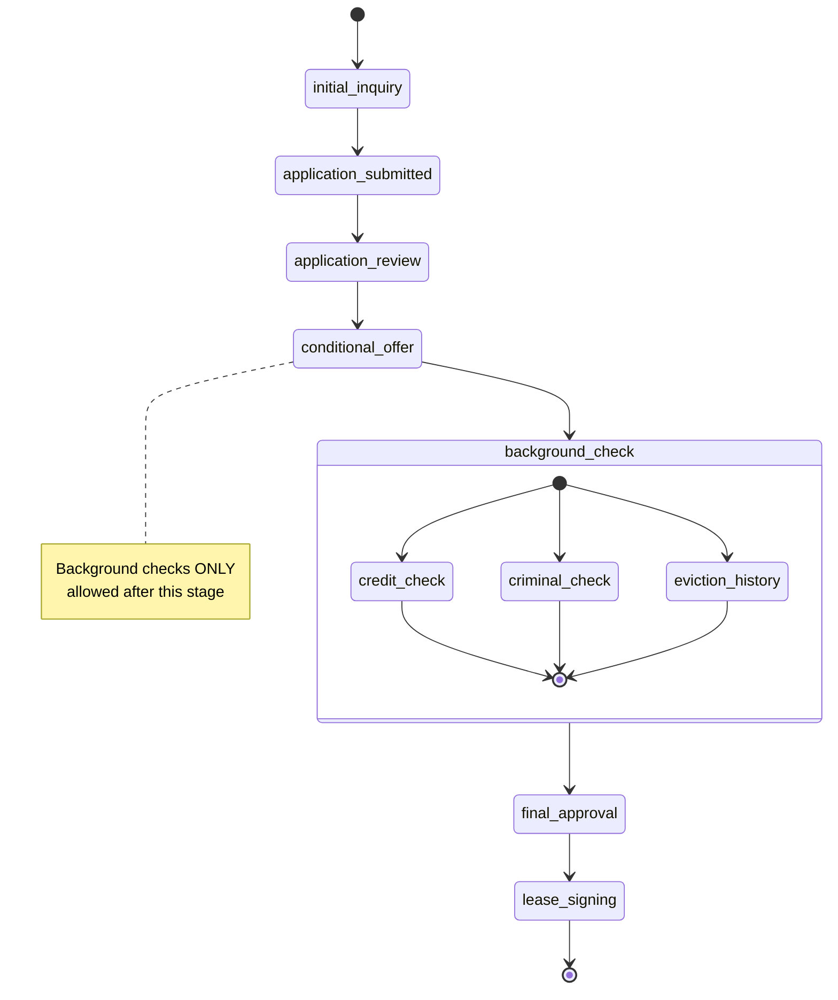
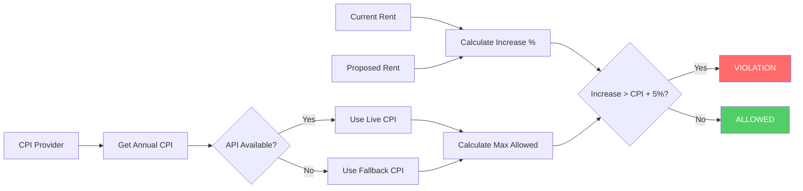

# Compliance Engine

Enterprise-grade compliance enforcement for real estate operations. Implements versioned Market Packs, Compliance Decision protocol, and hard enforcement gates.

## Overview

The Compliance Engine provides:
- **Versioned Market Packs**: Pre-configured compliance rule sets for different jurisdictions
- **Compliance Decision Objects**: Standardized format for all compliance evaluations
- **Hard Enforcement Gates**: Block non-compliant operations at workflow boundaries
- **Immutable Audit Trail**: Every compliance check is recorded with evidence

## Market Packs

| Pack ID | Version | Jurisdiction | Key Features |
|---------|---------|--------------|--------------|
| `NYC_STRICT` | 1.0.0 | New York City | FARE Act, FCHA, Good Cause Eviction, Rent Stabilization |
| `US_STANDARD` | 1.0.0 | United States | Fair Housing Act, Lead Paint Disclosure |
| `UK_GDPR` | 1.0.0 | United Kingdom | GDPR, Tenant Fees Act, Data Protection |

## Compliance Decision Format

```typescript
interface ComplianceDecision {
  passed: boolean;
  violations: Violation[];
  recommendedFixes: RecommendedFix[];
  policyVersion: string;
  marketPack: string;
  marketPackVersion: string;
  checkedAt: string;
  checksPerformed: string[];
  metadata?: Record<string, unknown>;
}

interface Violation {
  code: ViolationCode;
  message: string;
  severity: 'info' | 'warning' | 'violation' | 'critical';
  evidence?: Record<string, unknown>;
  ruleReference?: string;
  documentationUrl?: string;
}
```

## Enforcement Gates

### Listing Publish Gate (DRAFT → ACTIVE)

```typescript
import { gateListingPublish } from '@realriches/compliance-engine';

const result = await gateListingPublish({
  listingId: 'lst_123',
  marketId: 'nyc',
  hasBrokerFee: true,
  brokerFeePaidBy: 'tenant', // Will be blocked in NYC!
  monthlyRent: 3000,
  deliveredDisclosures: ['fare_act_disclosure'],
  acknowledgedDisclosures: [],
});

if (!result.allowed) {
  console.error(result.blockedReason);
  // "Listing cannot be published: FARE Act prohibits requiring tenant to pay broker fee"
}
```

### FCHA Stage Transition Gate

```typescript
import { gateFCHAStageTransition } from '@realriches/compliance-engine';

const result = await gateFCHAStageTransition({
  applicationId: 'app_123',
  marketId: 'nyc',
  currentStage: 'application_review',
  targetStage: 'background_check', // Will be blocked - must go through conditional_offer first
});
```

### Lease Signing Gate

```typescript
import { gateLeaseCreation } from '@realriches/compliance-engine';

const result = await gateLeaseCreation({
  leaseId: 'lse_123',
  marketId: 'nyc',
  monthlyRent: 3000,
  securityDepositAmount: 6000, // Blocked: exceeds 1 month max
  deliveredDisclosures: ['lead_paint_disclosure'],
  acknowledgedDisclosures: ['lead_paint_disclosure'],
});
```

## Compliance Flow



## FCHA Stage Order Enforcement



## Good Cause Rent Increase Calculation



## Violation Codes

### NYC (FARE Act, FCHA, Good Cause)

| Code | Severity | Description |
|------|----------|-------------|
| `FARE_BROKER_FEE_PROHIBITED` | Critical | Tenant cannot pay broker fee |
| `FARE_INCOME_REQUIREMENT_EXCESSIVE` | Violation | Income requirement > 40x rent |
| `FARE_CREDIT_SCORE_THRESHOLD_EXCESSIVE` | Violation | Credit score requirement > 650 |
| `FCHA_CRIMINAL_CHECK_BEFORE_OFFER` | Critical | Background check before conditional offer |
| `FCHA_STAGE_ORDER_VIOLATION` | Critical | Skipping application stages |
| `GOOD_CAUSE_RENT_INCREASE_EXCESSIVE` | Critical | Rent increase > CPI + 5% |
| `GOOD_CAUSE_EVICTION_INVALID_REASON` | Critical | Eviction reason not in allowed list |

### UK (GDPR)

| Code | Severity | Description |
|------|----------|-------------|
| `GDPR_CONSENT_MISSING` | Critical | No consent for data processing |
| `GDPR_LAWFUL_BASIS_MISSING` | Critical | No lawful basis specified |
| `GDPR_PRIVACY_NOTICE_MISSING` | Critical | Privacy notice not provided |
| `GDPR_DATA_SUBJECT_REQUEST_OVERDUE` | Critical | DSR not resolved in 30 days |
| `GDPR_DATA_RETENTION_EXCEEDED` | Violation | Data held beyond retention period |
| `GDPR_REDACTION_REQUIRED` | Warning | Sensitive fields need redaction |

## Integration with Database

The engine can persist compliance checks and audit logs:

```typescript
import { configureComplianceEngine } from '@realriches/compliance-engine';
import { prisma } from '@realriches/database';

configureComplianceEngine({
  async createAuditLog(entry) {
    const log = await prisma.auditLog.create({ data: entry });
    return log.id;
  },
  async createComplianceCheck(check) {
    const record = await prisma.complianceCheck.create({ data: check });
    return record.id;
  },
  async getMarketConfig(marketId) {
    return prisma.marketConfig.findUnique({ where: { marketId } });
  },
});
```

## Testing

```bash
# Run all compliance tests
pnpm test

# Run with coverage
pnpm test:coverage
```

## License

Proprietary - RealRiches Inc.
